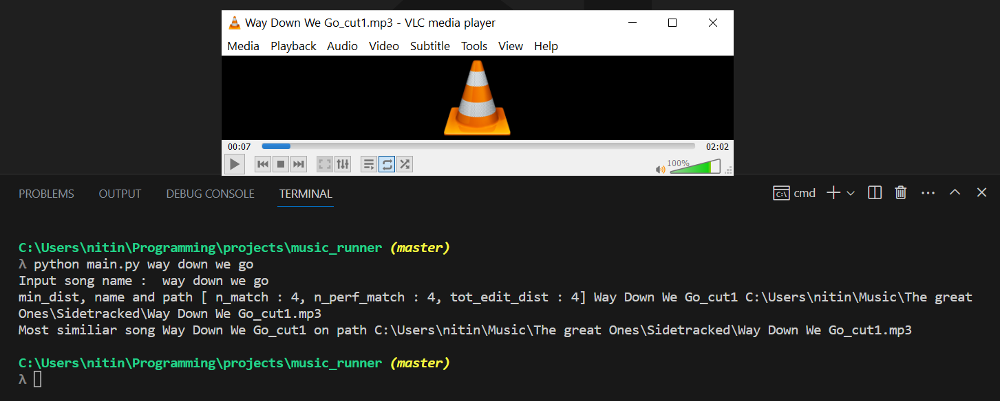
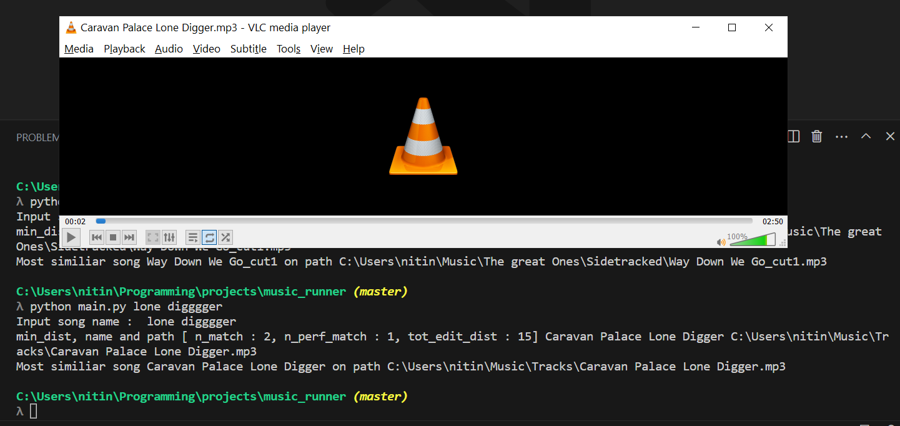
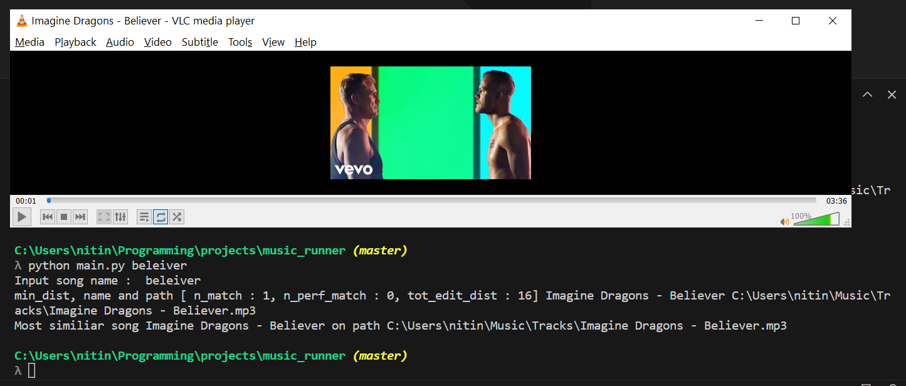
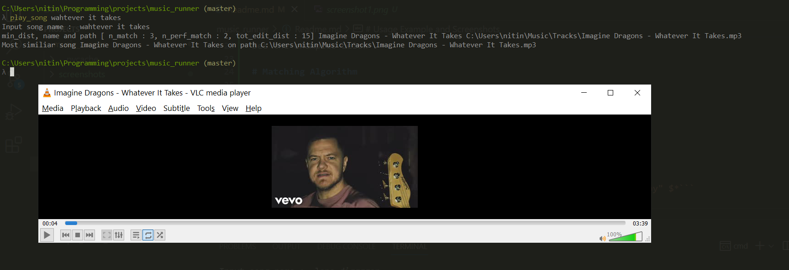
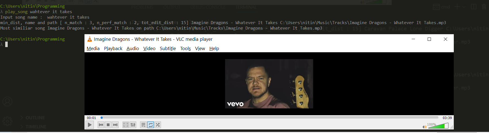

# Music Runner

A program to automatically play songs stored offline in the system based on approximate name matching.

# Todo
- [] Add screenshot images in Readme
- [x] Add Further Improvements

# Requirements
Python 3

## Tested on 
Python 3.11.3
Windows 10 64-bit system

(Not tested on linux or any other system)

# Usage

Provide this information in the cofig.py file : 
- List of directories to search for music files.
- Path of the music player

Run main.py file and provide name of song as command line arguement.
> Note - You dont need to use quotes while giving command line arguement, just give name as space seperated strings.
See the examples below .

# Matching Algorithm

For two strings, input string 'inp' and original string 'org', the distance is defined as a collection of three metrics
( These metrics are ordered according to the priority in considering closeness. For instance, n_perf_match is considered the most important
metric to determine closeness)
- n_perf_match : Number of perfectly matched words
- n_match : Number of matched words ( perfectly or approaximately matched)
- tot_edit_dist : Edit distance between the two strings (only alphanumeric characters considered, alphabate case is ignored)

For a given input, we just pick the song whose name matches the most.

# Further improvements

There are various cases on which the matching algorithm does not gives expected resuts.

- Priority of initial words
For input `cool`, `cool guy` should be preferred to `guy cool`.

- Consideration of amount of matching
For input `else paris`, `else pariis` should be preffered `else pariiis` 

- Extra words
For input `you`, `you` should be prefferd to `you are my love`

# Usage Example and Screenshots





Configured alias using `cmder` tool to be able to use the program anywhere:
```
play_song=python "C:\Users\nitin\Programming\projects\music_runner\main.py" $*
```

As shown in the images, the program is usable from any directory.


